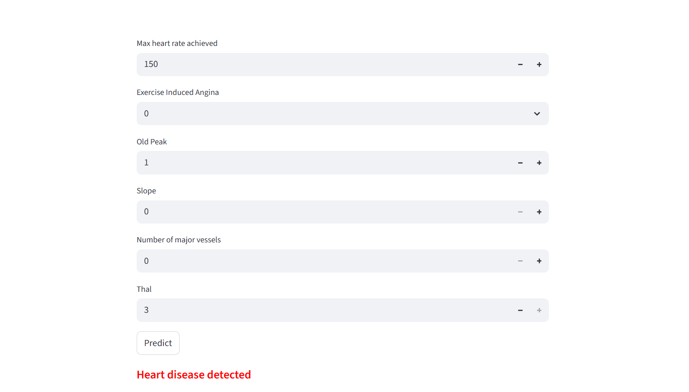

# Heart Disease Prediction using Logistic Regression

This project demonstrates the use of a **Logistic Regression Classifier** to analyze medical data and predict the presence of heart disease.

The focus is on model building, performance evaluation, and deploying the model using **Streamlit**.

---

## Problem Statement

To build a machine learning model that predicts whether a patient has heart disease based on clinical attributes such as age, cholesterol level, blood pressure, and heart rate.

---

## Dataset

* **Dataset:** Heart Disease Dataset

* **Target Variable:** `target`

  * `0` → No heart disease
  * `1` → Heart disease present

* **Features:**
  Age, sex, chest pain type, cholesterol, resting blood pressure, fasting blood sugar, resting ECG, maximum heart rate, exercise induced angina, oldpeak, slope, number of vessels, thal

---

## Project Workflow

1. Data loading and exploration
2. Data preprocessing and cleaning
3. Feature and target separation
4. Train-test split (80% training, 20% testing)
5. Model training using Logistic Regression
6. Model evaluation using:

   * Accuracy score
   * Confusion matrix
   * Classification report
7. Model saving using Pickle
8. Deployment using Streamlit
9. Hosting on Hugging Face Spaces

---

## Model Performance

| Metric            | Score |
| ----------------- | ----- |
| Training Accuracy | ~0.85 |
| Testing Accuracy  | ~0.80 |

*(Values may vary depending on training)*

---

## Deployment

The model is deployed using **Streamlit** and hosted on Hugging Face Spaces.

 **Live App:**
https://huggingface.co/spaces/Jidnyasa11/Heart_Disease

---

## App Preview



---

## Why Logistic Regression?

* Simple and efficient baseline model
* Works well for binary classification problems
* Easy to interpret
* Fast training and prediction

---

## Tools & Libraries

* Python
* Pandas
* NumPy
* Scikit-learn
* Streamlit
* Pickle

---

## Project Structure

```bash
HEART_DISEASE/
│
├── app.py              # Streamlit application
├── lr_model.pkl        # Trained model
├── heart.csv           # Dataset
├── requirements.txt    # Dependencies
└── README.md
```

---

## How to Run Locally

```bash
# Clone repository
git clone https://github.com/your-username/heart-disease.git
cd heart-disease

# Create virtual environment
python -m venv venv
venv\Scripts\activate

# Install dependencies
pip install -r requirements.txt

# Run app
streamlit run app.py
```

---

## Conclusion

Logistic Regression provides a reliable baseline for heart disease prediction.
The deployed web application allows users to input medical data and get instant predictions.

Future improvements can include advanced models, probability scores, and better UI design.

---

## Author

**Jidnyasa Thakre**

---
